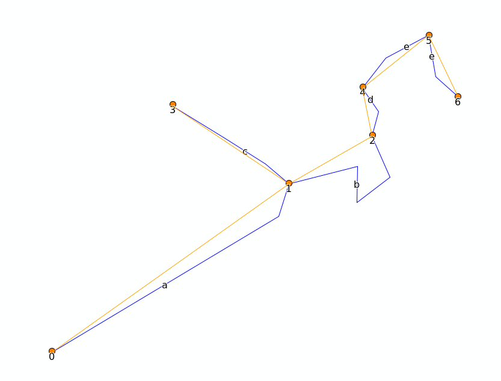

# Network module

##  Topology

The topology module will convert a shapefile containing lines to a topological network of lines:

* It will convert start and endpoints of every line to nodes
* a new line shape is created with three attributes
* the start_id and end_id will refer to the node_id, the length is the original length
* the shape is either the original shape, or a simplified straight line between the nodes if "SIMPLIFY" is selected
* if the original shapefile contains multiparts (eg e in the example above) each part will be exported as a separate line

In the example above, the original line c will be copied to a new shape with start_id 3 and end_id 1

| start_id | end_id |      length |
| -------: | -----: | ----------: |
|        0 |      1 |   1860.5233 |
|        1 |      2 | 1194.811345 |
|        3 |      1 |  876.026211 |
|        2 |      4 |  337.079592 |
|        4 |      5 |  536.973937 |
|        6 |      5 |  445.508516 |
