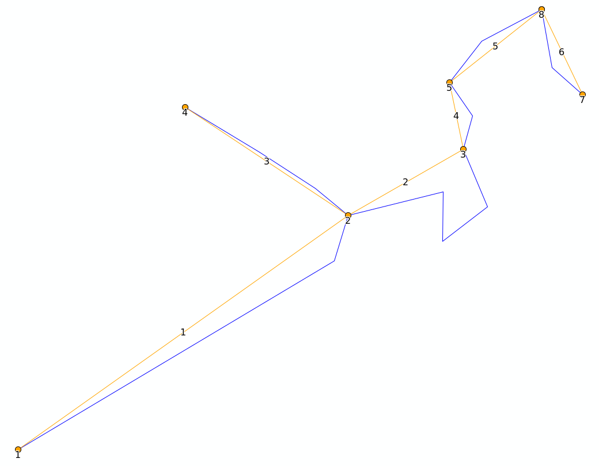
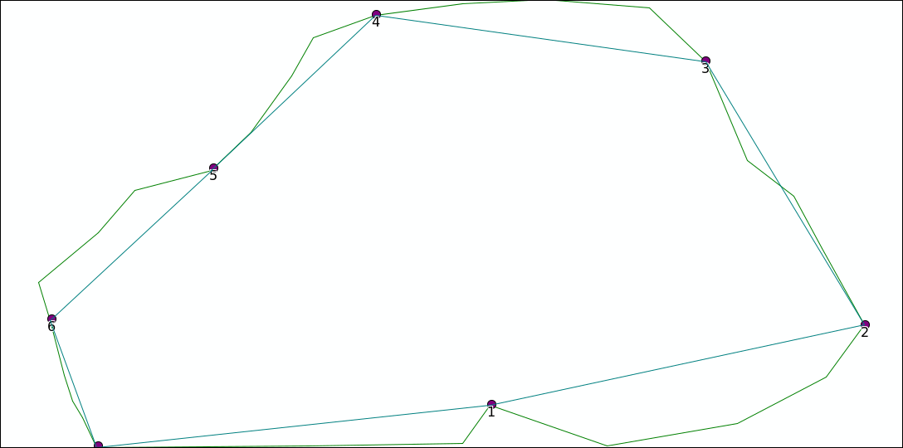

# Network module

##  Topology

The topology module will convert a shapefile containing lines to a topological network of lines: the direction of every line (ie the point order) is used to create a network from and to nodes.

* It will convert start and endpoints of every line to nodes
* a new line shape is created with three attributes
* the start_id and end_id will refer to the node_id, the length is the original length
* the shape is either the original shape, or a simplified straight line between the nodes if "SIMPLIFY" is selected
* if the original shapefile contains multiparts (eg e in the example above) each part will be exported as a separate line

In the example above, the original line c will be copied to a new shape with start_id 3 and end_id 1

|    line_id    | startpt_id | endpt_id |      length |
| ------------- | -------: | -----: | ----------: |
| 1             |        1 |      2 |   1860.5233 |
| 2             |        2 |      3 | 1194.811345 |
| 3             |        4 |      2 |  876.026211 |
| 4             |        3 |      5 |  337.079592 |
| 5             |        5 |      6 |  536.973937 |
| 6             |        7 |      8 |  445.508516 |

## Upstream edges

The upstream edges module takes the result from the above module and determines which edges are 

adjecant the current edge, and all edges which are above a current edge in _upstream edges_. 

The id used to determine the edge is the shape_index, which is the number of the line in the table above, starting from 0. Eg the edge with start_id 1 and end_id 2 would get shape_index 1.

In the table `adjecant edges` two edges will go to this line, and only one will come from this.

| from |   to |
| ---: | ---: |
|    1 |    2 |
|    2 |    4 |
|    3 |    2 |
|    4 |    5 |

For the `upstream_edges` this list will follow any link recursively, starting from any point in to not appearing in from. 

| edge | upstream_line | proportion |
| ---: | ------------: | ---------: |
|    2 |             1 |   1.000000 |
|    2 |             3 |   1.000000 |
|    4 |             1 |   1.000000 |
|    4 |             2 |   1.000000 |
|    4 |             3 |   1.000000 |
|    5 |             1 |   1.000000 |
|    5 |             2 |   1.000000 |
|    5 |             3 |   1.000000 |
|    5 |             4 |   1.000000 |

## Shreve order and Sort order

When running the upstream edges module, the input topology is amended with two columns: `shreve_order` and `sort_order`. 
Both get value 1 on lines with no upstream lines. `shreve_order` will always be the sum of the upstream lines. `sort_order` on the other hand will be equal to the the highest value of lines above the line +1.
When creating a grid, you may want to sort by `sort_order` to make sure lower lying river cells are converted last and written over lines with lower orders.

|line_id|startpt_id|endpt_id|length|shreve_order|sort_order|
|----:|----:|----:|----:|----:|----:|
|1|1|2|1860.523352|1|1|
|2|2|3|1194.811345|2|2|
|3|4|2|876.026211|1|1|
|4|3|5|337.079592|2|3|
|5|5|6|536.973937|2|4|
|6|7|6|445.508516|1|1|

### Special cases

### Split paths

In the example below the output of node 1 will go to two lines, b and d. In this case, only half of the input of a and c (shape_index 0 and 1) will be attributed to b (shape_index 3).

|line_id|startpt_id|endpt_id|length|shreve_order|sort_order|
|----:|----:|----:|----:|----:|----:|
|1.000000|1|2|1860.523352|1|1|
|2.000000|2|3|1194.811345|2|2|
|3.000000|4|2|876.026211|1|1|
|4.000000|2|3|635.651520|2|2|
|5.000000|3|5|245.821802|4|3|

|line_id|upstream_line|proportion|
|----:|----:|----:|
|2|1|0.500000|
|2|3|0.500000|
|4|1|0.500000|
|4|3|0.500000|
|5|1|1.000000|
|5|2|1.000000|
|5|3|1.000000|
|5|4|1.000000|

### Circular routes

in the drawing below, the direction of line d has been flipped (from 2 to 1). This creates a circular topology: 

##### Topology

|line_id|startpt_id|endpt_id|length|shreve_order|sort_order|
|----:|----:|----:|----:|----:|----:|
|1.000000|1|2|1860.523352|1|1|
|2.000000|2|3|1194.811345|3|2|
|3.000000|4|2|876.026211|1|1|
|4.000000|3|5|245.821802|3|3|
|5.000000|3|2|649.657639|1|1|

##### Upstream edges

For calculating the upstream edges this circular edge is split 

|line_id|upstream_line|proportion|
|----:|----:|----:|
|2|1|1.000000|
|2|3|1.000000|
|2|5|1.000000|
|4|1|1.000000|
|4|2|1.000000|
|4|3|1.000000|
|4|5|1.000000|

### Complete circle

Upstream segments are determined starting from points which have no downstream nodes. If a circle occurs without any nodes downstream of the circle, no upstream edges will be determined. Eg in the example below adjecant edges will contain all links, but upstream edges will be empty.

